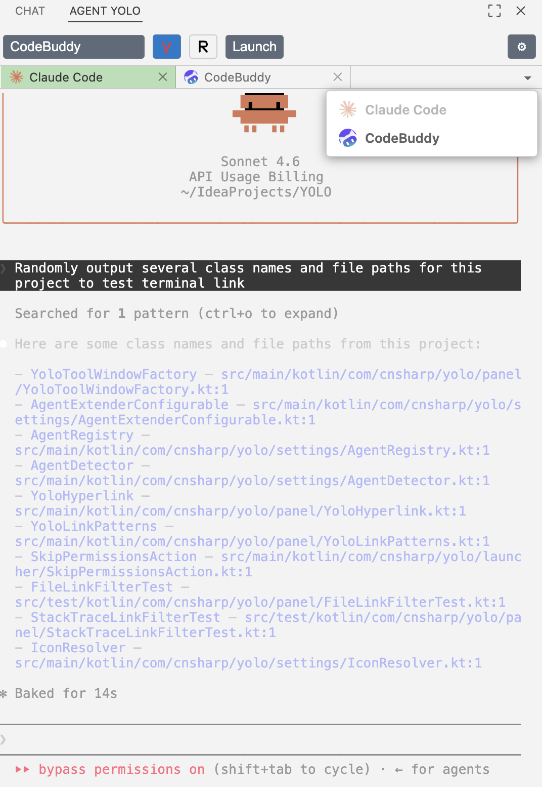
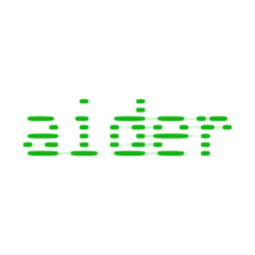
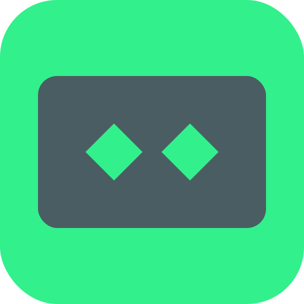
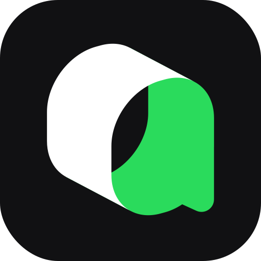
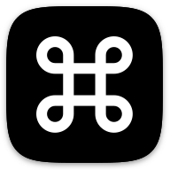

# Agent YOLO — AI Agents Extender (VS Code)

[](https://marketplace.visualstudio.com/items?itemName=cnsharp.agentyolo)

*Agent YOLO* 家族的 VS Code 版。它在 VS Code 中打开一个内嵌的终端面板，一键启动本机已安装的
AI CLI 智能体（Claude Code、Codex、Cursor CLI、…），并提供 **跳过权限（YOLO）** 开关；同时把终端输出变成
可点击的链接：文件路径、堆栈帧、类型/成员名、URL 都能直接跳转。

> 扩展 ID：`cnsharp.agentyolo` — 显示名 **Agent YOLO**。

## 截图

**智能体面板** — 内嵌的多标签页智能体终端，带有可点击链接：



## 功能特性

- **智能体面板**：停靠在活动栏中的视图，内含智能体下拉框；内容来自 `agents.json` 内置目录 + 你的 `yolo.agents` 覆盖项，并按本机实际安装的 PATH 过滤。
- **内嵌交互式终端**：基于真正的 PTY（node-pty + 打包的 xterm.js），在登录 shell 中启动，因此能识别 rc 文件注入的 PATH（nvm / fnm / npm 全局 bin）。多个智能体以 **标签页** 形式并排运行，每个标签页独立保留滚动缓冲与输入历史。
- **YOLO 开关**：注入每个智能体各自的跳过权限标志（如 `--dangerously-skip-permissions`、`-y`、`--yolo`）或环境变量（`GOOSE_MODE=auto`），让智能体在无权限确认的情况下运行。
- **Resume 开关**：通过智能体的 `resumeFlag`（如 Claude `-r`、Codex `--resume`）继续上一次会话。
- **可点击的终端链接**（带去重/优先级）：`路径:行:列`、带引号路径、堆栈帧、裸文件名、Python 回溯、类型名（`com.foo.Bar`）、`Class.member` 引用，以及 `http(s)://` URL。
  （**类型/成员链接需要语言服务器** — 见 [语言支持](#语言支持安装语言服务器以跳转类型成员链接)。）
- **设置驱动**：智能体配置（跳过标志 / 基础参数 / 续聊标志、全局 YOLO 与 Resume 默认值、shell）都放在 **VS Code 设置** 中 —— 在 `settings.json` 里编辑 `yolo.agents` 及其他 `yolo.*` 设置即可，面板内没有设置界面。（内部扩展 ID/设置保留 `yolo.` 前缀 —— 例如视图是 `yolo.panel`、设置是 `yolo.*` —— 而产品品牌名为 **Agent YOLO**。）

> **面板位置。** 智能体面板默认在 **主侧栏**（左侧活动栏）打开。如需停靠到右侧，右键面板标题选择
> **移动到副侧栏** —— VS Code 会记住这一选择。

> **共存。** Agent YOLO（`cnsharp.agentyolo`）使用独立的 `yolo.*` 设置命名空间，并拥有自己的命令与视图，因此可与其他同类扩展同时安装而互不冲突。

## 语言支持（安装语言服务器以跳转类型/成员链接）

文件路径链接开箱即用（基于文件系统解析）。**类型与成员链接（`com.foo.Bar`、`Class.member`）不同**：它们通过
`vscode.executeWorkspaceSymbolProvider`（即 LSP 的 `workspace/symbol`）解析，因此**必须运行并已索引该符号的语言服务器**，链接才能打开；否则会提示“no symbol found”。

为你实际使用的语言安装对应的语言服务器：

| 语言 | 扩展 | 扩展 ID |
|---|---|---|
| Java | Language Support for Java (Red Hat) | `redhat.java` |
| TypeScript / JavaScript | *内置 —— 无需安装* | — |
| Python | Python **+ Pylance**（由 Pylance 提供符号） | `ms-python.python`、`ms-python.vscode-pylance` |
| Go | Go (gopls) | `golang.go` |
| Rust | rust-analyzer | `rust-lang.rust-analyzer` |
| C / C++ | C/C++ | `ms-vscode.cpptools` |
| C# | C# | `ms-dotnettools.csharp` |
| Kotlin | Kotlin | `fwcd.kotlin` |
| PHP | Intelephense | `bmewburn.vscode-intelephense-client` |
| Ruby | Ruby LSP | `shopify.ruby-lsp` |
| Scala | Metals | `scalameta.metals` |
| Swift | Swift | `sswg.swift-lang` |
| Lua | Lua | `sumneko.lua` |
| Dart / Flutter | Dart | `Dart-Code.dart-code` |
| Shell | Bash IDE | `mads-hartmann.bash-ide-vscode` |

注意：

- **把代码作为工作区文件夹打开**，并等语言服务器完成索引（大型 Java/Python 项目首次打开可能较慢） —— 未索引的符号无法解析。
- 单纯的语法高亮或格式化插件**不够**，必须是真正的语言服务器。
- 按需安装即可：每个语言服务器都是一个常驻进程、占用各自内存，叠加多个开启的智能体终端后开销会累积。
- Java 推荐使用 **Red Hat**（`redhat.java`）；Oracle 的 Java 扩展 `workspace/symbol` 支持不稳定。

## 安装

### 从 VS Code Marketplace 安装（推荐）

- 打开 [Agent YOLO Marketplace 页面](https://marketplace.visualstudio.com/items?itemName=cnsharp.agentyolo) 点击 **安装**。
- 或在 VS Code 中：打开 **扩展** 视图，搜索 `Agent YOLO` 并点击 **安装**。
- 或通过命令行：

  ```sh
  code --install-extension cnsharp.agentyolo
  ```

### 从源码运行（开发 / 试用）

1. 安装依赖：`npm install`（会执行 `postinstall` 修复 node-pty 的 `spawn-helper` 权限）。
2. 构建：`npm run build`（tsc 编译扩展 + esbuild 把 webview 打包进 `media/dist`）。
3. 按 **F5** 打开扩展开发宿主窗口；活动栏中会出现 **Agent YOLO** 图标。

### 打包 / 以 VSIX 安装

- 打包：`npx @vscode/vsce package`（生成 `*.vsix`）
- 安装：在 VS Code 中执行 `Extensions: Install from VSIX...` 并选择生成的文件。

## 使用

### 打开面板

- 点击活动栏中的 **Agent YOLO** 图标，或在命令面板中运行 **`Agent YOLO: Open Agents Panel`**（命令 id `yolo.openPanel`）。

### 启动智能体

- 在面板标题处的下拉框中选择智能体并点击 **Launch** —— 会在新终端标签页中打开。仅显示 PATH 上检测到的智能体。
- 可继续打开更多智能体并排运行；像普通 IDE 终端一样切换标签页。

### YOLO 模式（跳过权限 / 自动放行）

- 点击面板标题处的 `$(zap)` 按钮切换 YOLO 模式。开启后，启动智能体会附加该智能体的 `skipFlag`（Goose 为 `GOOSE_MODE=auto`）。
- 也可通过 `yolo.yoloMode` 设置设定全局默认值。

### Resume 模式（继续会话）

- 点击面板标题处的 `$(history)` 按钮切换 Resume 模式。开启后，启动智能体会附加其 `resumeFlag` 以继续上一次会话；没有 `resumeFlag` 的智能体即使开启也正常启动。
- YOLO 与 Resume 可同时开启；参数顺序为 `baseArgs` → `skipFlag` → `resumeFlag`。
- 也可通过 `yolo.resumeMode` 设置设定全局默认值。

### 配置智能体（无需改代码）

**`yolo.agents`** 设置是一个覆盖/新增列表，与 `agents.json` 内置目录**合并**：按 `command`（或 `id`）匹配内置项进行覆盖（只替换你设置的字段）；把 `enabled` 设为 `false` 可隐藏某内置项；使用一个不在 `agents.json` 中的 `command` 即可新增自定义智能体。

- **编辑**：内置项位于根目录 `agents.json`；要调整某内置项，追加一条相同 `command` 的覆盖条目（只写想改的字段）。
- **覆盖参数**：只改你想改的字段，例如把 `claude` 的 `skipFlag` 改成 `"--new-flag"`。
- **隐藏**：把 `enabled` 设为 `false`（或删除该条目）。
- **新增自定义智能体**：追加一条 `command` 非内置的条目，例如：

  ```json
  { "command": "myagent", "displayName": "My Agent", "baseArgs": "run", "iconFile": "myagent.png" }
  ```

  （省略 `iconFile` 则使用默认终端图标。）
- **生效时机**：下次面板刷新时生效（运行时实时读取，无需重载窗口）。

字段：`command`（必填）/ `displayName` / `baseArgs` / `skipFlag` / `resumeFlag` / `iconFile` / `enabled` / `id`。

> 唯一性：`command`、`displayName`、`id` 必须各自唯一。出现重复时扩展会告警并丢弃重复项（保留首次出现者）。

### 支持的 agent 列表

| id | 显示名 | 命令 (PATH 探测) | 官网 |
|---|---|---|---|
| claude | Claude Code | `claude` | <a href="https://claude.ai/"></a> |
| codex | Codex | `codex` | <a href="https://openai.com/codex"></a> |
| cursor | Cursor | `cursor-agent` | <a href="https://cursor.com/"></a> |
| copilot | GitHub Copilot | `copilot` | <a href="https://github.com/features/copilot"></a> |
| opencode | OpenCode | `opencode` | <a href="https://opencode.ai/"></a> |
| aider | Aider | `aider` | <a href="https://aider.chat/"></a> |
| cline | Cline | `cline` | <a href="https://cline.bot/"></a> |
| continue | Continue | `cn` | <a href="https://continue.dev/"></a> |
| openclaw | OpenClaw | `openclaw` | <a href="https://openclaw.ai/"></a> |
| kiro | Kiro | `kiro-cli` | <a href="https://kiro.dev/"></a> |
| goose | Goose | `goose` | <a href="https://block.github.io/goose/"></a> |
| crush | Charm Crush | `crush` | <a href="https://charm.sh/crush"></a> |
| amp | Amp | `amp` | <a href="https://ampcode.com/"></a> |
| kimi | Kimi | `kimi` | <a href="https://kimi.moonshot.cn/"></a> |
| qwen-code | Qwen Code | `qwen` | <a href="https://qwen.ai/qwencode"></a> |
| trae | TraeCode | `traecli` | <a href="https://www.trae.ai/"></a> |
| codebuddy | CodeBuddy | `codebuddy` | <a href="https://www.codebuddy.ai/"></a> |
| qoder | Qoder | `qoder` | <a href="https://qoder.com/"></a> |
| devin | Devin | `devin` | <a href="https://devin.ai/"></a> |
| grok | Grok | `grok` | <a href="https://grok.com/"></a> |
| antigravity | Antigravity | `agy` | <a href="https://antigravity.google/"></a> |
| mistral-vibe | Mistral Vibe | `vibe` | <a href="https://mistral.ai/"></a> |
| kilo | Kilo Code | `kilo` | <a href="https://kilocode.ai/"></a> |
| hermes | Hermes | `hermes` | <a href="https://hermes-agent.nousresearch.com/"></a> |
| pi | Pi | `pi` | <a href="https://pi.dev/"></a> |
| droid | Droid | `droid` | <a href="https://factory.ai/"></a> |
| aug | Auggie | `auggie` | <a href="https://augmentcode.com/"></a> |
| rovo | Rovo Dev | `rovo` | <a href="https://rovo.atlassian.com/"></a> |
| prime-agent | Prime Agent | `prime-agent` | <a href="https://www.primeintellect.ai/"></a> |
| autohand | Autohand | `autohand` | <a href="https://autohand.ai/"></a> |
| command-code | Command Code | `command-code` | <a href="https://commandcode.ai/"></a> |
| ante | Ante | `ante` | <a href="https://antigma.ai/"></a> |
| codebuff | Codebuff | `codebuff` | <a href="https://codebuff.com/"></a> |
| omp | OMP | `omp` | <a href="https://ohmyposh.dev/"></a> |

> logo 位于 `media/agents/`（PNG）。下拉只显示 displayName，不显示 command / id。

## 设置参考

| 设置 | 类型 | 默认值 | 说明 |
|---|---|---|---|
| `yolo.yoloMode` | boolean | `false` | YOLO 模式总开关；开启后启动智能体附加各自的 `skipFlag` |
| `yolo.resumeMode` | boolean | `false` | Resume 模式总开关；开启后启动智能体附加各自的 `resumeFlag` |
| `yolo.agents` | array | `[]` | 与 `agents.json` 合并的覆盖/新增（见上） |
| `yolo.permissionRules` | array | `[]` | 按 `{ agentId, flag }` 给出的每智能体跳过标志；优先于 `yolo.agents` 的 `skipFlag` |
| `yolo.agentResumeFlags` | object | `{}` | 按 `command` / `id` 给出的每智能体续聊标志覆盖；优先于 `resumeFlag` |
| `yolo.agentBaseArgs` | object | `{}` | 按 `id`（`command` 兜底）给出的每智能体额外启动参数；附加在 `baseArgs` 之后 |
| `yolo.shell` | string | `""` | 覆盖启动智能体 / 探测 PATH 所用的 shell（绝对路径或 PATH 上的二进制；Windows 上留空时自动探测 POSIX shell） |
| `yolo.shellArgs` | array | `[]` | 传给 shell、位于智能体命令之前的额外参数（Windows `cmd.exe` 下忽略） |
| `yolo.installedCommands` | array（内部） | `[]` | PATH 上检测到的智能体命令缓存 —— 自动维护，请勿手改 |
| `yolo.lastAgentId` | string（内部） | `""` | 上次选中的智能体 id，便于面板预选 —— 自动设置 |

命令：

| 命令 id | 标题 | 触发 |
|---|---|---|
| `yolo.openPanel` | Agent YOLO: Open Agents Panel | 活动栏图标 / 命令面板 |

## 构建与运行（开发）

```bash
npm install        # 安装依赖并执行 postinstall（node-pty spawn-helper chmod）
npm run build      # tsc（扩展 + webview 入口）+ esbuild（将 xterm 打包进 media/dist）
npm test           # 链接引擎的单元测试
# 在 VS Code 中打开本文件夹按 F5 -> “Run Extension” 启动扩展开发宿主。
# 运行命令：Agent YOLO: Open Agents Panel
```

## 目录结构

```
src/
  extension.ts                 激活 + 命令 + 视图提供器注册
  agents.ts                    从 agents.json 加载内置目录 + resolveAgents()/getAgentConfigWarnings()
  agentDetector.ts             安装检测（resolvePath / canExecute），登录 shell 以识别 rc PATH
  settings/                    settings.json 驱动的配置（schema 在 package.json contributes.configuration）
  links/                       链接正则模式（移植）+ 行解析器
  navigation/                  文件打开 + workspace-symbol 查找（对应 gotoClassContributor）
  terminal/
    terminalProvider.ts        node-pty 启动（移植的启动路径）
    panel.ts                   WebviewViewProvider，持有 PTY + 消息桥
    panelHtml.ts               打包后 webview 的 CSP 安全 HTML 渲染器
    shell.ts                   shell 解析（yolo.shell / yolo.shellArgs）
  webview/
    panel.ts                   打包后的 webview 入口：xterm + 组合链接提供器
media/dist/                    esbuild 输出（打包的 xterm）—— 由 webview 引用
media/agents/                 智能体图标（PNG）
media/icons/                  活动栏 / 面板图标 + Y/R 切换 SVG
scripts/
  ensure-node-pty-exec.cjs     postinstall：对 node-pty 的 spawn-helper 设置可执行权限
test/                          node:test 单元测试（linkPatterns / linkParser）
```

webview 通过 esbuild 打包（无 CDN），并以严格 CSP 从 `localResourceRoots` 提供。

## 架构说明

1. **面板（活动栏）**：`activate()` 加载内置目录（`initBuiltInAgents`）、刷新安装缓存，并为 `yolo.panel` webview 视图（位于 `yolo-agents` 活动栏容器）注册 `YoloViewProvider`。面板的 `yolo.openPanel` 命令负责显示/聚焦它。
2. **安装检测**：`canExecute(command)` 在登录交互式 shell 中执行 `<command> --version`，以退出码 0 视为已安装；结果缓存到 `yolo.installedCommands` 设置，避免每个窗口重复探测 PATH。在 macOS/Linux 使用 `$SHELL -lc`、Windows 使用 `where`，因此能识别 rc 文件注入的 PATH（nvm / fnm / brew / npm-global 等）。
3. **内嵌终端**：`terminalProvider.ts` 在登录 shell 中通过 node-pty 启动智能体；PTY 输出桥接到打包的 xterm webview，用户输入写回。每次 Launch 都打开带独立滚动缓冲的新标签页。
4. **可点击链接**：webview 的组合链接提供器用 `links/` 中的模式扫描终端输出，把匹配项变成可跳转链接 —— 文件路径在编辑器中打开，类型/成员链接通过 workspace-symbol 提供器解析（需语言服务器），URL 在浏览器中打开。
5. **设置驱动**：`resolveAgents()` 按 `command` / `id` 把 `agents.json` 内置目录与 `yolo.agents` 设置合并，并校验 `command` / `displayName` / `id` 的唯一性（`getAgentConfigWarnings` 输出告警）。

## 如何新增一个智能体

两条路径，取决于你是否要改代码：

**路径 A：仅改设置（推荐，用户侧，无需重新构建）**

在 `settings.json` 的 `yolo.agents` 追加一条：

```json
{ "command": "myagent", "displayName": "My Agent", "baseArgs": "", "skipFlag": "--auto", "iconFile": "myagent.png" }
```

把图标放到 `media/agents/myagent.png` —— 无需重新编译。

**路径 B：作为内置项新增（代码侧）**

1. 编辑根目录 `agents.json`，追加一条（`id` / `command` / `displayName` / `baseArgs` / `skipFlag` / `resumeFlag` / `iconFile`）。
2. 把对应 PNG 放到 `media/agents/`。
3. `npm run build`，然后重载窗口。

> 注意：运行时设置为权威来源。若用户已覆盖 `yolo.agents`，新增的内置项需用户在设置中也追加一条（或删掉覆盖以恢复默认）才会出现。
