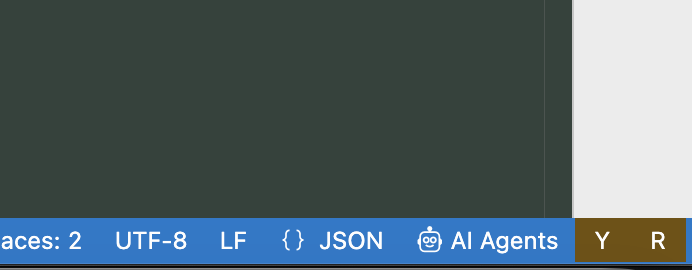
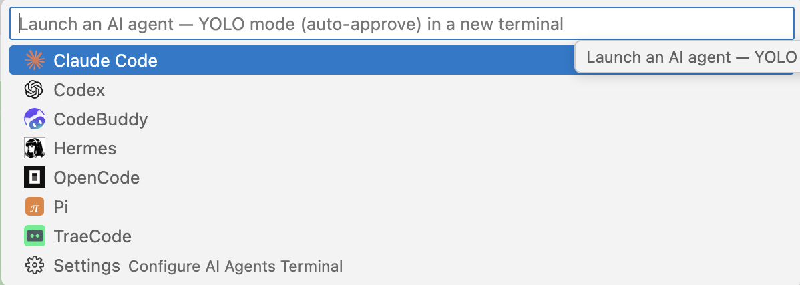

# AI Agents Terminal

[](https://marketplace.visualstudio.com/items?itemName=cnsharp.ai-agents-terminal)

Launch the AI CLI coding assistants installed on your machine (Claude Code / Codex / Cursor / …) from the VS Code status bar with one click, opening each in a logo'd terminal tab. Supports a YOLO (auto-approve) mode, filters by what's installed, and lets you freely add / remove / configure agents — no code changes required.

## Features

- **Status-bar launcher**: a `🤖 AI Agents` button at bottom-right → opens a Quick Pick listing only the agents **installed** on PATH (with logos); pick one to open it in a new terminal tab.
- **YOLO mode**: toggle via the `Y` status-bar button or the `Ctrl/Cmd+Alt+Y` shortcut; when on, each agent launches with its own auto-approve args (e.g. Claude's `--dangerously-skip-permissions`).
- **Resume mode**: toggle via the `R` status-bar button or the `Ctrl/Cmd+Alt+R` shortcut; when on, each agent launches with its own `resumeFlag` (e.g. Claude's `-r`) to continue the most recent session.
- **Data-driven**: the supported agents (defined in the root `agents.json`) are recognized by default; override params, hide, or add custom agents from Settings — no code changes needed.
- **Terminal profiles**: installed agents are registered as Terminal profiles, surfacing in `Terminal: Select Default Profile` (filtered by install status, can be set as the default terminal).

## Screenshots

**Status bar** — `🤖 AI Agents`, `Y`, and `R` buttons in the bottom-right corner:



**Quick Pick** — click `🤖 AI Agents` to choose an installed agent (logos from `agents.json`):



## Install

### From the VS Code Marketplace (recommended)

- Open the [AI Agents Terminal Marketplace page](https://marketplace.visualstudio.com/items?itemName=cnsharp.ai-agents-terminal) and click **Install**.
- Or in VS Code: open the **Extensions** view, search for `AI Agents Terminal`, and click **Install**.
- Or from the command line:

  ```sh
  code --install-extension cnsharp.ai-agents-terminal
  ```

### Run from source (development / trial)

1. Install dependencies: `npm install`
2. Compile: `npm run compile` (or `npm run watch` to rebuild on change)
3. Press **F5** to open the Extension Development Host window; the new window's status bar shows `🤖 AI Agents`.

### Package / install as VSIX

- Package: `npx @vscode/vsce package` (produces a `*.vsix`)
- Install: in VS Code run `Extensions: Install from VSIX...` and pick the generated file.

## Usage

### Launch an agent

- Click `🤖 AI Agents` at bottom-right, choose from the Quick Pick (only installed agents are listed), and it opens in a new terminal tab.
- Or run `AI Agents` from the Command Palette (command id `ai-agents-terminal.openMenu`).
- A `Settings` item is pinned at the bottom of the Quick Pick to open this extension's settings page directly.

### YOLO mode (auto-approve)

- Click the `Y` status-bar button, or use `Ctrl+Alt+Y` (`Cmd+Alt+Y` on macOS).
- When on, the button highlights; launching an agent automatically appends that agent's `skipFlag`.

### Resume mode (continue session)

- Click the `R` status-bar button, or use `Ctrl+Alt+R` (`Cmd+Alt+R` on macOS).
- When on, the button highlights; launching an agent automatically appends that agent's `resumeFlag` from `agents.json` (e.g. Claude `-r`, Codex `--resume`, Cursor `--resume`), continuing the previous session. Agents without a `resumeFlag` (e.g. Continue, Kimi, Qoder) append nothing even when on.
- YOLO and Resume can be on together; args are ordered `baseArgs` → `skipFlag` → `resumeFlag`.

### Configure agents (no code required)

The **`aiAgentsTerminal.agents`** setting is a list of overrides / additions **merged** with the agent catalog in `agents.json`: match a supported agent by `command` to override it (only the fields you set are replaced); set `enabled` to `false` to hide a supported agent; use a `command` not present in `agents.json` to add a custom agent.

- **Edit**: the catalog agents live in the root `agents.json`; to tweak a catalog agent, append an override entry with the same `command` (only the fields you want to change).
- **Override params**: change only the fields you want, e.g. set `claude`'s `skipFlag` to `"--new-flag"`.
- **Hide**: delete the entry, or keep it and set `enabled` to `false`.
- **Add a custom agent**: append an entry whose `command` isn't in the catalog, e.g.:

  ```json
  { "command": "myagent", "displayName": "My Agent", "baseArgs": "run", "iconFile": "myagent.png" }
  ```

  (omit `iconFile` to use the default terminal icon.)
- **When it takes effect**: changes apply the next time the picker opens (read live at runtime, no window reload needed).

Fields: `command` (required) / `displayName` / `baseArgs` / `skipFlag` / `resumeFlag` / `iconFile` / `enabled` / `id`.

> Uniqueness: `command`, `displayName`, and `id` must each be unique. On duplicates the extension warns and drops the duplicate (keeping the first occurrence).

### Supported agent list

| id | display name | command (PATH detection) | website |
|---|---|---|---|
| claude | Claude Code | `claude` | <a href="https://claude.ai/"></a> |
| codex | Codex | `codex` | <a href="https://openai.com/codex"></a> |
| cursor | Cursor | `cursor-agent` | <a href="https://cursor.com/"></a> |
| copilot | GitHub Copilot | `copilot` | <a href="https://github.com/features/copilot"></a> |
| opencode | OpenCode | `opencode` | <a href="https://opencode.ai/"></a> |
| aider | Aider | `aider` | <a href="https://aider.chat/"></a> |
| cline | Cline | `cline` | <a href="https://cline.bot/"></a> |
| continue | Continue | `cn` | <a href="https://continue.dev/"></a> |
| openclaw | OpenClaw | `openclaw` | <a href="https://openclaw.ai/"></a> |
| kiro | Kiro | `kiro-cli` | <a href="https://kiro.dev/"></a> |
| goose | Goose | `goose` | <a href="https://block.github.io/goose/"></a> |
| crush | Charm Crush | `crush` | <a href="https://charm.sh/crush"></a> |
| amp | Amp | `amp` | <a href="https://ampcode.com/"></a> |
| kimi | Kimi | `kimi` | <a href="https://kimi.moonshot.cn/"></a> |
| qwen-code | Qwen Code | `qwen` | <a href="https://qwen.ai/qwencode"></a> |
| trae | TraeCode | `traecli` | <a href="https://www.trae.ai/"></a> |
| codebuddy | CodeBuddy | `codebuddy` | <a href="https://www.codebuddy.ai/"></a> |
| qoder | Qoder | `qoder` | <a href="https://qoder.com/"></a> |
| devin | Devin | `devin` | <a href="https://devin.ai/"></a> |
| grok | Grok | `grok` | <a href="https://grok.com/"></a> |
| antigravity | Antigravity | `agy` | <a href="https://antigravity.google/"></a> |
| mistral-vibe | Mistral Vibe | `vibe` | <a href="https://mistral.ai/"></a> |
| kilo | Kilo Code | `kilo` | <a href="https://kilocode.ai/"></a> |
| hermes | Hermes | `hermes` | <a href="https://hermes-agent.nousresearch.com/"></a> |
| pi | Pi | `pi` | <a href="https://pi.ai/"></a> |
| droid | Droid | `droid` | <a href="https://factory.ai/"></a> |
| aug | Auggie | `auggie` | <a href="https://augmentcode.com/"></a> |
| rovo | Rovo Dev | `rovo` | <a href="https://rovo.atlassian.com/"></a> |
| prime-agent | Prime Agent | `prime-agent` | <a href="https://www.primeintellect.ai/"></a> |
| autohand | Autohand | `autohand` | <a href="https://autohand.ai/"></a> |
| command-code | Command Code | `command-code` | <a href="https://commandcode.ai/"></a> |
| ante | Ante | `ante` | <a href="https://antigma.ai/"></a> |
| codebuff | Codebuff | `codebuff` | <a href="https://codebuff.com/"></a> |
| omp | OMP | `omp` | <a href="https://ohmyposh.dev/"></a> |

> Logos live in `media/agents/` (PNG). The picker shows only the display name, not the command / id.

### Terminal profiles (Terminal: Select Default Profile)

Each **installed** agent is registered at runtime as a Terminal profile via `registerTerminalProfileProvider`, appearing in the Command Palette's `Terminal: Select Default Profile` where it can be set as the default terminal; the terminal icon is the agent logo.

> Platform limitation: in this VS Code build, extension profiles do **not** appear in the Terminal `+` caret dropdown or the title-bar menu — only in `Select Default Profile` (see "Platform limitations" below).

## Settings reference

| Setting | Type | Default | Description |
|---|---|---|---|
| `aiAgentsTerminal.yoloMode` | boolean | `false` | Master switch for YOLO mode; when on, agents launch with their respective `skipFlag` |
| `aiAgentsTerminal.resumeMode` | boolean | `false` | Master switch for Resume mode; when on, agents launch with their respective `resumeFlag` |
| `aiAgentsTerminal.agents` | array | `[]` | Overrides / additions merged with agents.json (see above) |
| `aiAgentsTerminal.installedAgents` | array (hidden) | `[]` | Cache of detected agent commands, maintained automatically — **do not edit by hand** |

Commands:

| Command id | Title | Trigger |
|---|---|---|
| `ai-agents-terminal.openMenu` | AI Agents | status-bar button / Command Palette |
| `ai-agents-terminal.toggleYoloMode` | AI Agents: Toggle YOLO Mode | `Y` button / `Ctrl+Alt+Y` (`Cmd+Alt+Y` on macOS) |
| `ai-agents-terminal.toggleResumeMode` | AI Agents: Toggle Resume Mode | `R` button / `Ctrl+Alt+R` (`Cmd+Alt+R` on macOS) |

## Contributing / secondary development

### Environment

- Node.js + npm
- VS Code `^1.85.0`
- TypeScript `^5.4.0`

### Build & debug

- `npm install` to install devDependencies (`typescript` / `@types/node` / `@types/vscode`).
- `npm run compile` compiles `src/*.ts` → `out/` (plain `tsc`, no bundling step).
- `npm run watch` rebuilds on change.
- Press **F5** to launch the Extension Development Host and set breakpoints in `src/extension.ts`.

### Project structure

```
ai-agents-vsc/
├── package.json          # manifest: name=ai-agents-terminal, publisher=cnsharpstudio
│                         #   contributes.configuration: yoloMode / agents / installedAgents
│                         #   contributes.commands + keybindings
├── tsconfig.json         # TS config (outDir=out, rootDir=src)
├── src/
│   ├── extension.ts      # entry: registers commands + status-bar buttons; QuickPick lists
│   │                     #   installed agents; dynamically registers Terminal profiles
│   │                     #   (registerTerminalProfileProvider)
│   ├── agents.ts         # loads the built-in catalog from agents.json + resolveAgents()/getAgentConfigWarnings()
│   │                     #   (merges built-ins with the aiAgentsTerminal.agents setting, dedupes)
│   └── agentDetector.ts  # isInstalled(): runs `<command> --version` to probe PATH
│                         #   (login shell -lc, honours nvm/fnm/brew/npm-global; where on win32)
├── media/agents/         # agent logos (PNG)
├── .vscode/              # launch.json (Run Extension) + tasks.json (npm compile)
└── out/                  # build output (tsc)
```

### Architecture notes

1. **Launcher (status bar)**: `activate()` first refreshes the installed cache (`refreshInstalledCache`, probing PATH only once across windows), the `🤖 AI Agents` button opens a Quick Pick listing only cached installed agents, and selection launches via `vscode.window.createTerminal` using the agent's `command` + `baseArgs` (plus `skipFlag` in YOLO mode), with the logo icon.
2. **Install detection**: `isInstalled(command)` runs `<command> --version` in a login-interactive shell, treating exit code 0 as installed; results are cached in the global `installedAgents` setting so PATH isn't re-probed per window. `agentDetector.ts` uses `$SHELL -lc` on macOS/Linux and `where` on Windows, so it honours PATH injected by rc files (nvm / fnm / brew / npm-global, etc.).
3. **Terminal profiles (install-filtered)**: `registerInstalledTerminalProfiles()` registers a `TerminalProfileProvider` per **installed** agent, so `Terminal: Select Default Profile` lists only what's installed; uninstalled agents never appear. This improves on the static `contributes.terminal.profiles` declaration, which can't filter by install status.
4. **Settings-driven**: `resolveAgents()` merges the `agents.json` built-in catalog with the `aiAgentsTerminal.agents` setting by `command`, and validates `command` / `displayName` / `id` uniqueness (`getAgentConfigWarnings` emits the warnings).

### How to add an agent

Two paths, depending on whether you want to ship code:

**Path A: settings only (recommended, user-side, no rebuild)**

Append an entry to `aiAgentsTerminal.agents` in your `settings.json`:

```json
{ "command": "myagent", "displayName": "My Agent", "baseArgs": "", "skipFlag": "--auto", "iconFile": "myagent.png" }
```

Drop the logo into `media/agents/myagent.png` — no recompile needed.

**Path B: add as a built-in (code-side)**

1. Edit the root `agents.json` and append an entry (`id` / `command` / `displayName` / `baseArgs` / `skipFlag` / `iconFile`).
2. Put the corresponding PNG into `media/agents/`.
3. `npm run compile`, then reload the window.

> Note: the runtime setting is authoritative. If a user has overridden `aiAgentsTerminal.agents`, a newly added built-in only appears once they also add it to their setting (or remove the override to restore the defaults).
